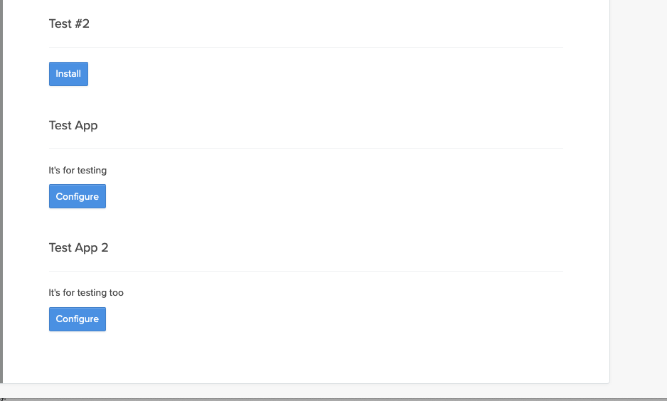

# Lessonly App Overview

## Creating a Lessonly App

Creating a new app is a manual process right now. You first need to open a console in the environment where you want to create the app, then use the following command:

```Ruby
Demux::App.create(
  name: "Acme App",
  description: "A helpful description of my app",
  account_types: ["company"],
  signal_url: "https://acme.com/webhooks",
  entry_url: "https://acme.com/configure",
  signals: ["test", "lesson_editing"]
)
```

Let's break down the arguments that we supplied.

***name*** - A user facing name that will be displayed for your app.

***description*** - A user facing description of what your app does.

***account_types*** - What type of account should this app connect with when installed? It can be either "company" or "user"

***signal_url*** - The URL where signals will be posted for this app. See more on signals [here](signals.md)

***entry_url*** - URL where a user will be directed with a signed token in order to complete configuration of your app.

***signals*** - An array of the names of signals your app wants to listen for (if any).

You now have a new Lessonly App!

## Installation and Configuration

A Lessonly App will be listed on the integrations page when a company is authorized to install it. Here is how they appear on that installation page:




If a app has not been installed on this company before, the use will be presented with the "Install" button. When they click the install button, a `Demux::Connection` will be created between that company and the app. The user will then be redirected to the `entry_url` of the app along with a JWT. The URL they are redirected too for the app in our create example will look like this with the token attached: https://acme.com/configure?token=arst15earstne435irstie34arst4

At the time this connection is created, the signals from the app at that time will be copied to the connection record (see [signals](signals.md)). If new signals are added to the app in the future, you need to manually add the same signal to all of it's existing connections `app.connections.update_all(signals: app.signals)`. Saving the signals on the connection separate from the app is to facilitate asking for permission before listening to new signals on an existing connection in the future.

The JWT is signed using the apps `secret`. When your app receives the request to this entry point, you should verify the token before using it's contents. Here is an example of how to do that in Ruby using the [ruby-jwt gem](https://github.com/jwt/ruby-jwt):

```Ruby
token_contents = JWT.decode(
  token,
  secret_from_app,
  true,
  algorithm: "HS256"
)
```

Another good example would be to look at how this is done in our [test app](https://github.com/lessonly/lessonly_apps_test_dummy)

The contexts of the token once decoded will look something like this:
```JSON
[
  {"data": {"account_id":9, account_type:"company", "company_id": 9, "user_id":42}, "exp": 1594737582},
  {"typ": "JWT", "alg": "HS256"}
]
```

Most of the contents of that token will be used to verify the JWT and make sure it hasn't expired. The "data" key contains the account_id, which is the ID of either a Lessonly Company or User that the connection is being made too, account_type which specifies if the connection is to a company or user account, company_id which contains the ID of the company this connection is within and user_id which contains the ID of the current user that is attempting to make the connection. You can use the information in this data field to provision the newly installed account.


